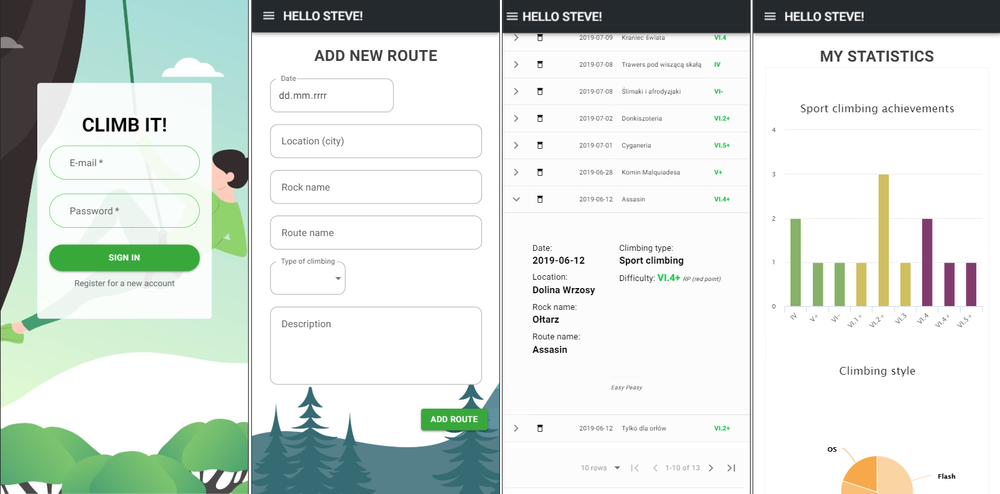

# Climb It App

## Table of contents
* [General info](#general-info)
* [Technologies](#technologies)
* [Setup](#setup)
* [Status](#status)
* [Contact](#contact)

## General info
This is a simple climbing outdoor tracker. You can sign up, input what you climbed and check out your personal statistics. 
Track of your highest climbs, and visually see how your climbing is improving.

## Technologies
* HTML5
* CSS
* React JS
* Material UI
* Redux
* ESlint
* Firebase/Firestore
* PWA

## Setup
To run this project, install it locally using npm:

* Clone this repository
$ git clone https://github.com/ewelina-slepko/Climb-It

* Go into the repository
$ cd Climb-It

* Install dependencies
$ npm install

* Run the app
$ npm start

* Progressive Web App - 
The game [page](https://climb-it-application.firebaseapp.com/) is served as a PWA, so you can play offline on your phone.

## Status
Project is: _in progress_.

## Contact
Created by Ewelina Ślepko (slepko.ewelina@gmail.com) - feel free to contact me!
